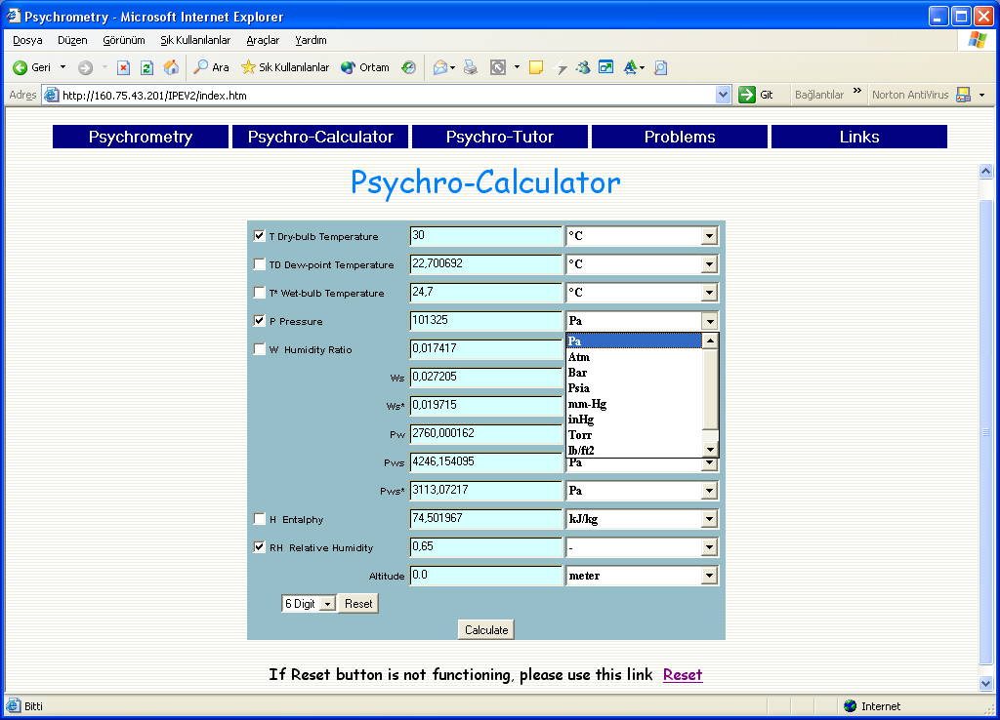
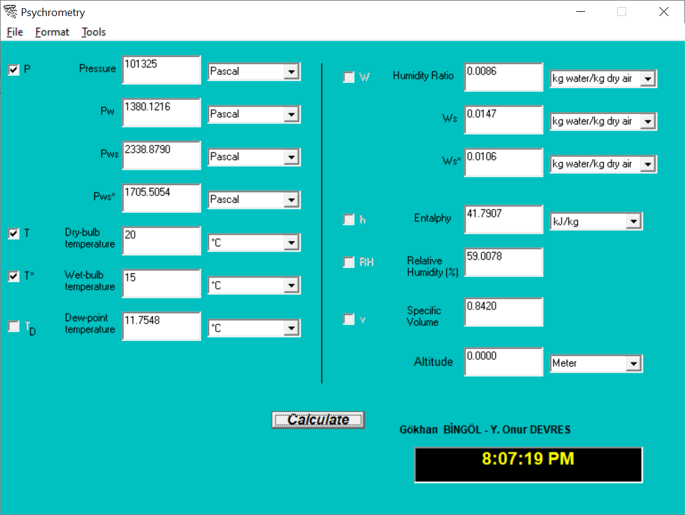
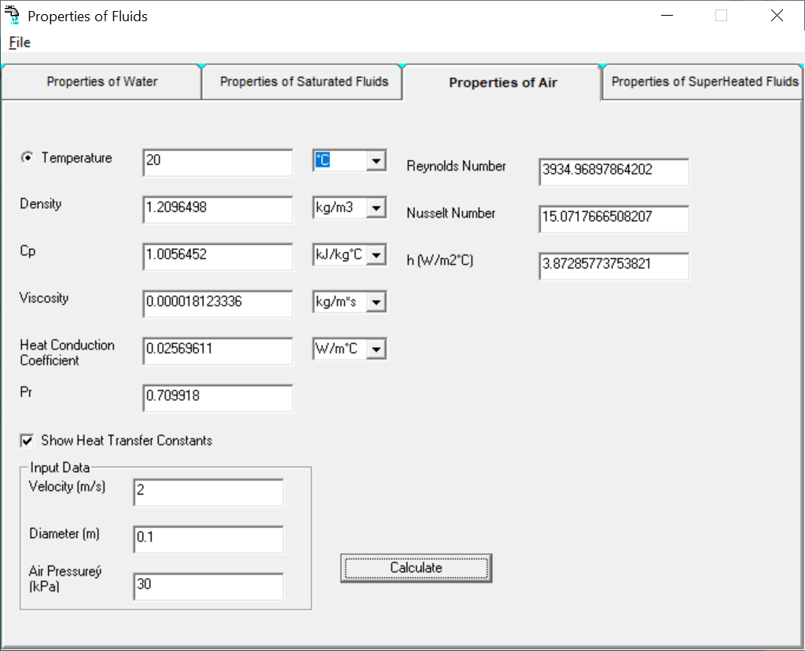
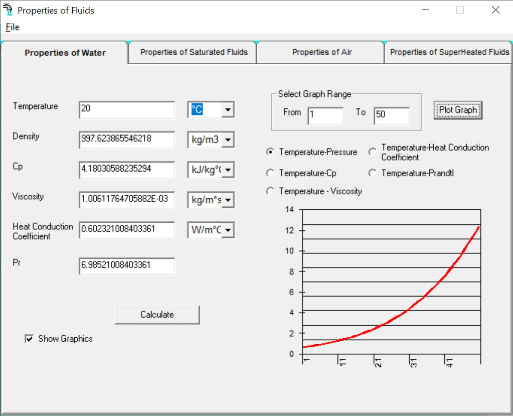
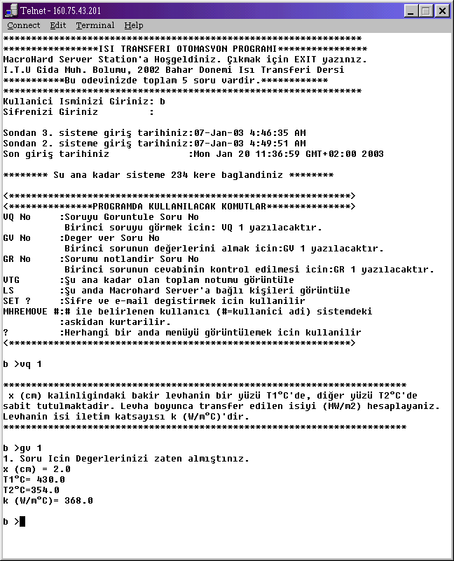

# Tools for Fundamental Engineering Courses
Tools developed are:
- Psychrometric software (as applet and desktop app)
- Psychrometry Questions (as applets)
- Homework system (as telnet and Java Server Pages)
  - Heat Transfer
  - Advanced Thermodynamic 
  - Thermodynamic
- Tutorials for Heat Transfer

&nbsp;

## Psychrometry

Developed as Java Applet. Exactly 3 properties must be selected 
and the rest are computed.

&nbsp;

Developed using Visual Basic as desktop app. Exactly 3 properties must be selected 
and the rest are computed.

### Properties of air
A tool to compute properties of dry air.

### Properties of Water
A tool to compute thermo-physical properties of water.

## Telnet System

## Java Server Pages

&nbsp;

## PDF Documents

- *Computer Assisted Calculations of Psychrometric Properties of Humid Air* 
contains procedures used in development of psychrometric software both in 
Java and Visual Basic.

&nbsp;

## Note
The codes have not been maintained since 2008.
